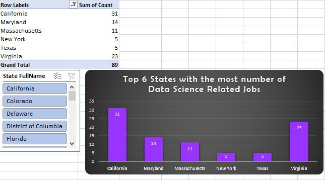

# Midterm Lab-Task 3 - Creating Dashboard and Pivot Table
This portfolio presents an interactive Excel dashboard designed to uncover insights into Data Science salaries and job trends. Using pivot tables, charts, slicers, and an optional map, it visualizes job distribution, salary variations by role and company size, and sector-specific employment patterns.
# Step 1: Open the Data File
- Use the worksheet with raw job data and salary tables:
- Salary by Role
- Salary by State
- Salary by Company Size
# Step 2: Decide What to Show in the Dashboard
- The state with the most Data Science jobs
- The job role with the highest average salary
- The company size that pays the highest salary
- The sector with the most and least Data Science jobs
- The sector with the highest and lowest average salary
# Step 3: Create Pivot Tables
- Use pivot tables to organize job and salary data etc..
# Step 4: Make Charts for Better Understanding
- Use bar, column, or pie charts to show salary trends and job distribution, Depends on you
# Step 5: Add Slicers for Easy Filtering
- Include slicers for job role, company size, and state to make filtering simple
# Step 6: Add a Map
- If Excel allows, use a map to show job distribution by state
# Step 7: Improve Design & Layout
- Change colors, fonts, and layout to make the dashboard clear and easy to read
# Step 8: Check and Finalize the Dashboard
- Make sure all important visuals are included
- Test slicers to ensure they work correctly

# Screenshots Captured During Analysis
- Salary by role
  

- Salary by size

- Salary by state

- Salary be sector

- Sector by size

# Dashboard

# US STATES map with Numbers of Employed in Data Science Careers

